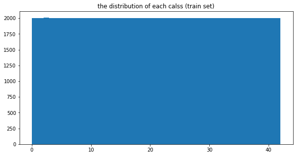
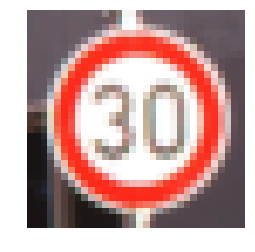
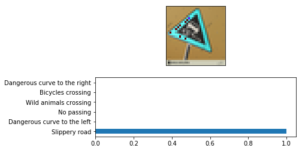
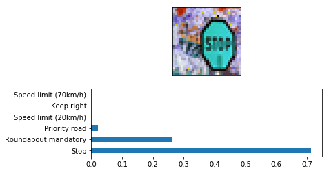
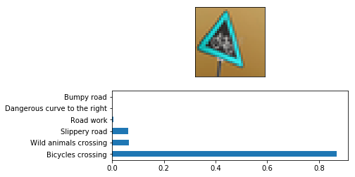
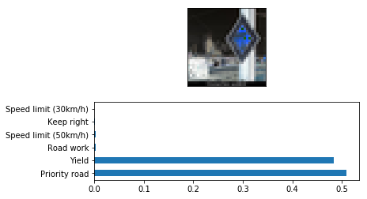
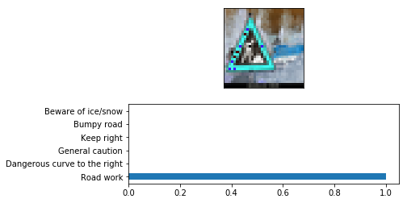

# **Traffic Sign Recognition** 

**Build a Traffic Sign Recognition Project**

The goals / steps of this project are the following:
* Load the [traffic sign dataset](http://benchmark.ini.rub.de/?section=gtsrb&subsection=dataset) 
* Explore, summarize and visualize the data set
* Design, train and test a model architecture
* Use the model to make predictions on new images
* Analyze the softmax probabilities of the new images
* Summarize the results with a written report

## Project 
Here is the link to my code [Traffic_Sign_Classifier](Traffic_Sign_Classifier.ipynb)

### Data Set Summary & Exploration

**1. Provide a basic summary of the data set** 

I used the numpy and pandas library to calculate summary statistics of the traffic signs data set:

* The size of training set is : 34799
* The size of the validation set is : 4410 
* The size of test set is : 12630
* The shape of a traffic sign image is : 32x32x3 (3 RGB channels)
* The number of unique classes/labels in the data set is : 43 ( by using set() function )

**2. Include an exploratory visualization of the dataset**

Here is an exploratory visualization of the data set.

Firstly, we looked into some random sample image of the data set.

And then we looked at the distribution of classes in the training, validation and test set.

### Design and Test a Model Architecture

**1. agumented tranning set**

**Reason:** The distribution of data set showing above tells that there is an huge imbalance in the training set between classes. The maximum value is 2010 while the minimum value is only 180. So i thought it would be good if we could balance the traning set, and make even distribution 

Here is the improvement i made. I agument the training date set and made it become even distributed.

**2. grayscale transformation**

**Reason:** we want to reduce the layers of the original images and make it traning faster. And the second reason is the work given by [naokishibuya](https://github.com/naokishibuya/car-traffic-sign-classification/blob/master/Traffic_Sign_Classifier.ipynb) His work shows grayscale would have better traning performace than RGB format.

Here is an example of an original image and an grayscale image:

**3. normalization transformation**

**Reason:** The gradient-based algorithm is used to optimize the traning results. It suggest the mean of input value should 0. So i would like to normalize the traning data set. According to [naokishibuya's work](https://github.com/naokishibuya/car-traffic-sign-classification/blob/master/Traffic_Sign_Classifier.ipynb), he suggest that using the mean and standard deviation would serves as better performance. 
* The formula is : (x - x.mean()) / x.std()

### Model architecture

The first architecture i try is LeNet model. I think this a staring point. However, The validation set accuracy can not reach 90%. The basic work i do is to make the networks much deeper than before and also add a dropout layer. Besides, i use more neurons in the fully connected layers.

**My final model consisted of the following layers:**

| Layer         		|     Description	        					| 
|:---------------------:|:---------------------------------------------:| 
| Input         		| 32x32x1 grayscale image   					| 
| Convolution 5x5     	| 1x1 stride, VALID padding, outputs 28x28x64 	|
| Max pooling			| 2x2 stride,  outputs 14x14x64					|
| RELU	      	        | 		                                 		|
| Convolution 5x5	    | 1x1 stride, VALID padding, outputs 10x10x128	|
| Max pooling	     	| 2x2 stride,  outputs 5x5x128    				|
| RELU   				|           									|
| Flatten       		| Input 5x5x36, Output 3200						|
| Fully connected		| Input 900, Output 1024						|
| Dropout       		| 50%						                    |
| RELU           		|                       						|
| Fully connected		| Input 1024, Output 512						|
| Dropout       		| 50%						                    |
| RELU           		|                       						|
| Fully connected		| Input 512, Output 128 						|
| Dropout       		| 50%						                    |
| RELU           		|                       						|
| Fully connected		| Input 128, Output 43  						|

* Optimizer: AdamOptimizer

* Learning rate: 0.002

* Dropout probability: 0.5

* Batch size: 128

* Epoch: ~ 20 

**My final model results were:**

* training set accuracy of 0.999
* validation set accuracy of 0.977
* test set accuracy of 0.965
---

### Test a Model on New Images

**Choose five German traffic signs found on the Googel**

Here are five German traffic signs that I found on the web:

* The first picture might be easy, but the angle of traffic sign might be a challenge for classify.

* In second picture there is white area in the traffic sign which may negatively affect the classifier.

* The third picture is same as picture 1

* In last two picture, the outside environment might affect the classifier. 
---

## The prediction of the five new images:

* the accurary is 1.00

